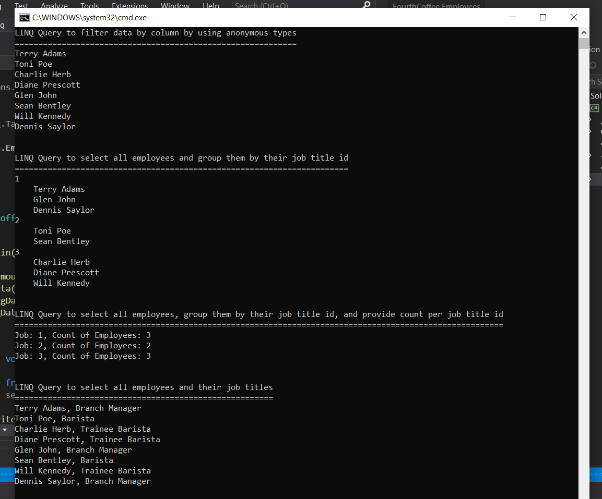

1. **Nombres y apellidos:** Carola Casais Recondo
2. **Fecha:** Domingo 18 de octubre de 2020
3. **Resumen del Ejercicio:** El objetivo de este ejercicio es consultar datos usando LINQ y funciones anónimas.
LINQ permite usar C# (o el lenguaje .NET que prefiera) para escribir consultas fuertemente tipadas. Usa el contexto derivado y las clases de entidad para hacer referencia a los objetos de base de datos. EF Core pasa una representación de la consulta LINQ al proveedor de la base de datos. A su vez, los proveedores de la base de datos la traducen al lenguaje de la consulta específico para la base de datos (por ejemplo, SQL para una base de datos relacional).
4. **Dificultad o problemas presentados y como se resolvieron:** No hubo dificultades en este ejercicio.

